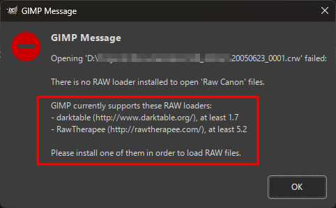
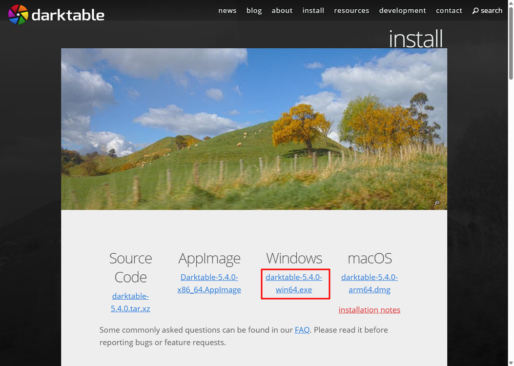
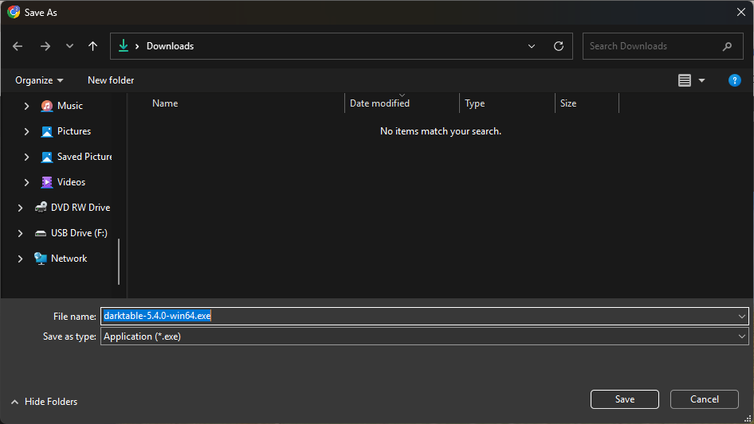
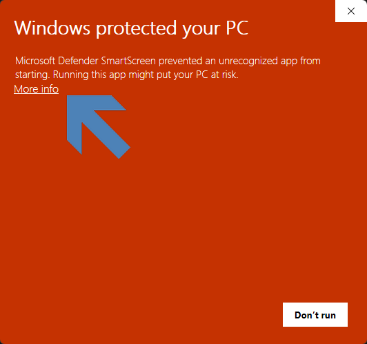
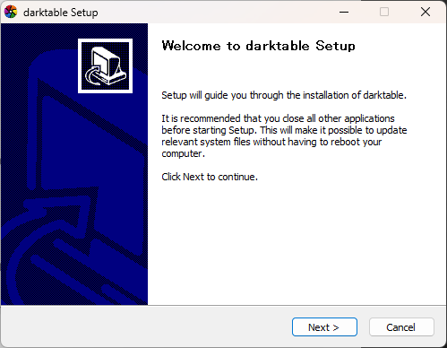
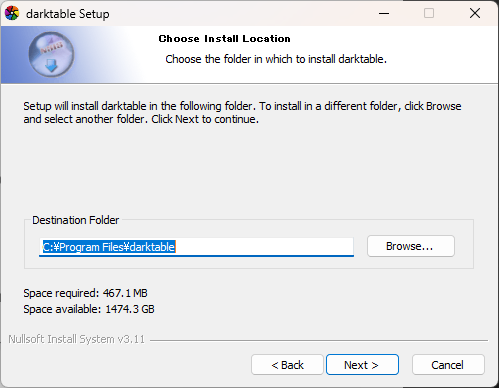
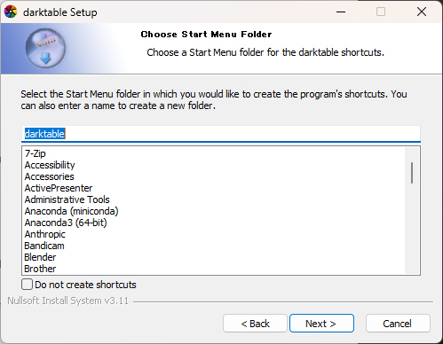
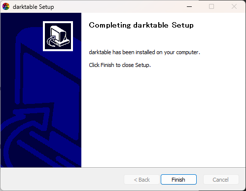
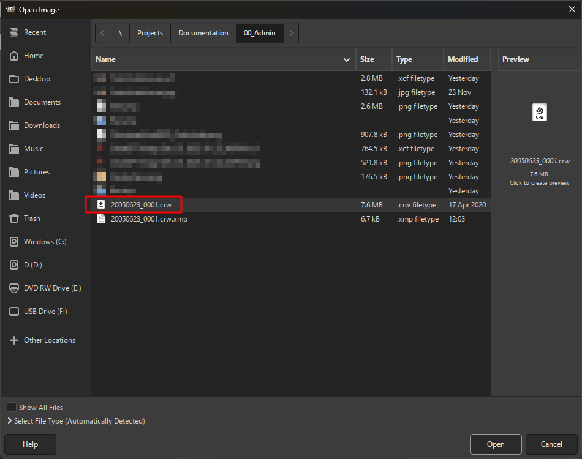
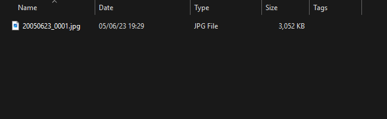

# Convert CRW to PNG

1. Read the message.
     

1. Select **Install**.
     

1. Click the download link.
     

1. Download the installer.
    

1. Click **More info**.
    

1. Click **Next**.
    

1. Click **Next**.
    

1. Click **Next**.
    

1. Click **Finish**.
    

1. Open the **CRW** file.
    

1. Select **Export**.
    

1. Adjust the settings, then export.
    

1. The conversion is complete.
    