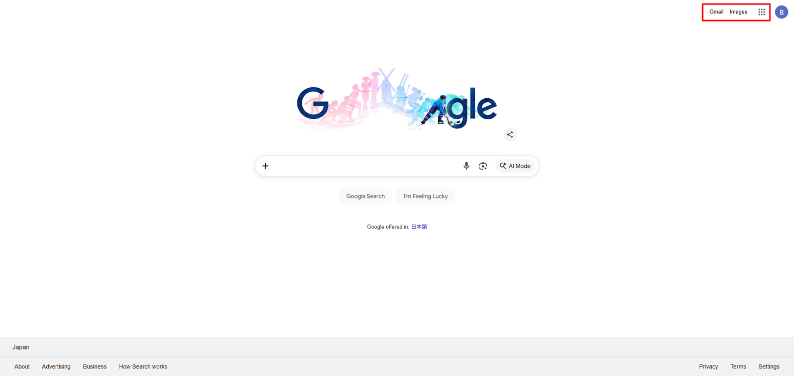
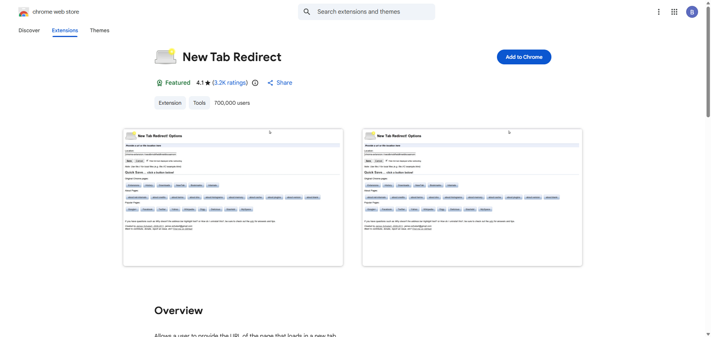
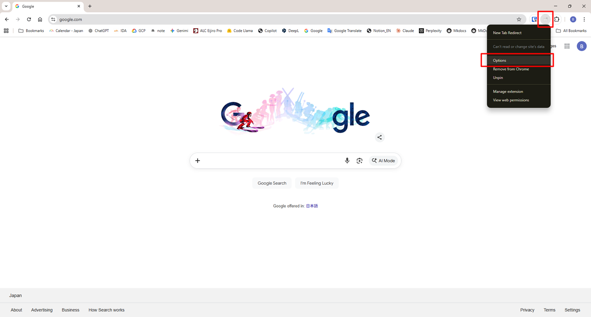
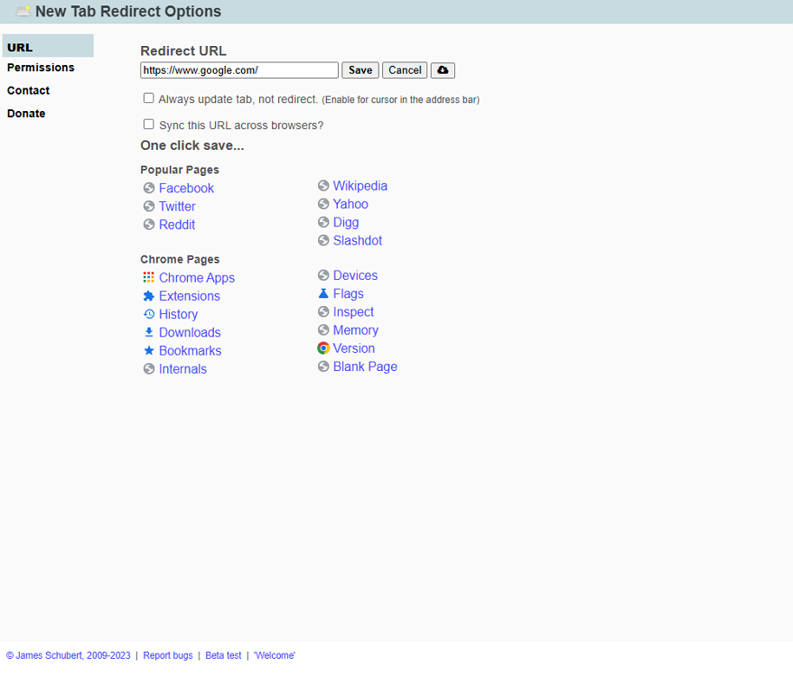

# Show the Google menu on a new tab

To display the Google menu (Gmail, Images, Google Apps, and your profile icon), you need to open the Google homepage:
[https://www.google.com/](https://www.google.com/)  
However, Chrome does not natively allow changing the New Tab page to a custom URL.
To do this, you need to use a small Chrome extension to redirect the New Tab page.

---

## Steps

1. Open **Google Chrome**.

2. Go to the Chrome Web Store:

      [https://chrome.google.com/webstore](https://chrome.google.com/webstore)

3. Install the extension named **New Tab Redirect**.

      

4. Click the **New Tab Redirect** extensions icon, then **Options**.

      

5. Enter the following URL and click **Save**:  
   https://www.google.com/

      

---

## Result

When you open a new tab, the Google homepage will appear with:

* Gmail
* Images
* Google Apps menu
* Your Google account icon
