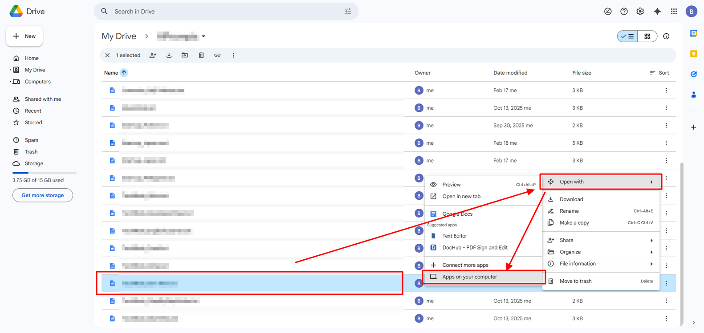
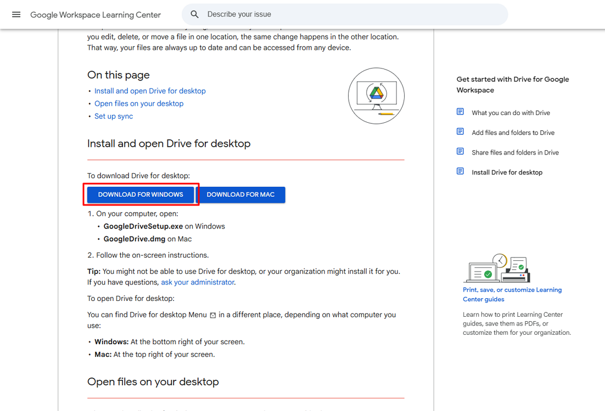
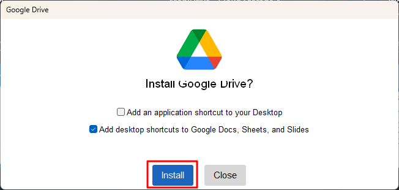
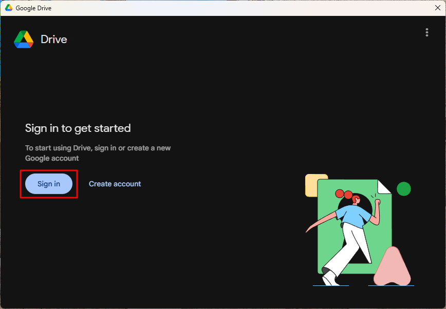
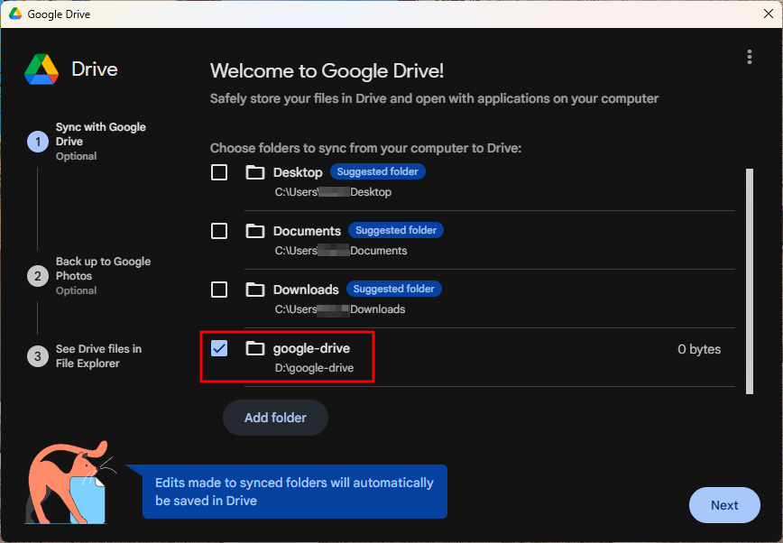
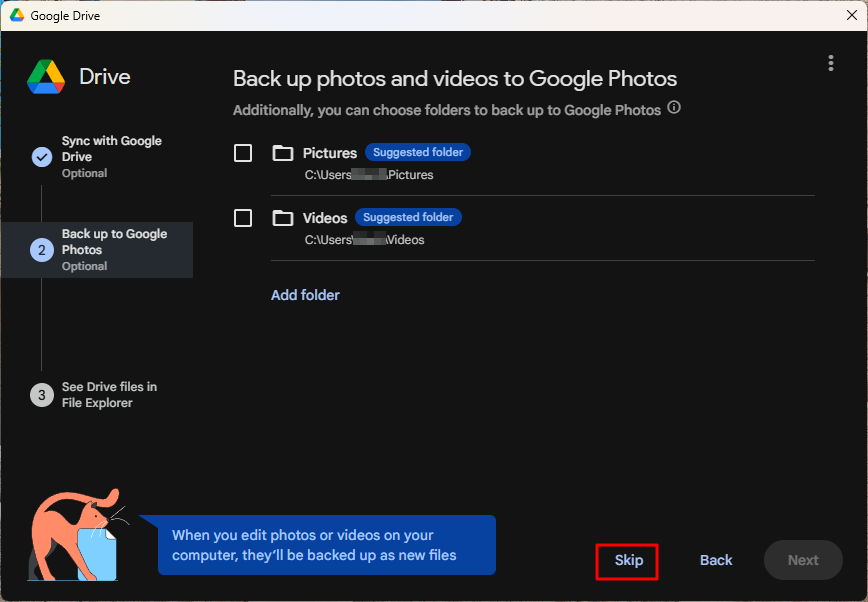

# Edit Google Drive stored md files with Notepad++

Install Google Drive for desktop, access Drive files from File Explorer, and edit `.md` files using Notepad++. Changes sync automatically to Google Drive.

---

## Steps

### 1. Install Google Drive for desktop

1. Open the Google Drive for desktop download page.

    

2. Click **Download for Windows**.

    

3. Run the installer.

4. In the installer window, click **Install**.

    

5. Click **Sign in**.

    

6. Select folders to sync.

    

7. Click **Skip** to disable optional backups.

    

8. Click **Open Drive**.

    

---

### 2. Open Google Drive in File Explorer

1. Open **File Explorer**.

2. Click **Google Drive (G:)**, then **My Drive**.

    

3. Navigate to the folder containing your `.md` file.

    

---

### 3. Open and edit the md file with Notepad++

Option A: From File Explorer

1. Right-click the `.md` file.
2. Click **Open with**.
3. Select **Notepad++**.
4. Edit the file.
5. Click **Save**.

Option B: From Notepad++

1. Open **Notepad++**.
2. Click **File** → **Open**.
3. Navigate to:

        Google Drive (G:) → My Drive

4. Select the file.
5. Edit and save.

---

### 4. Verify sync status

1. Click the **Google Drive icon** in the system tray.
2. Confirm the status shows:

        Up to date

This confirms your edits have synced.

---

## Optional

### Make files available offline

1. Right-click the file in **File Explorer**.
2. Click **Offline access**.
3. Click **Available offline**.

### Troubleshooting

**Google Drive does not appear in File Explorer**

* Restart Google Drive for desktop
* Sign in again if prompted

**Changes do not sync**

* Click the Google Drive icon in the system tray
* Confirm status shows **Up to date**

**Notepad++ cannot open the file**

* Verify the file is inside `Google Drive (G:)`
* Refresh File Explorer

