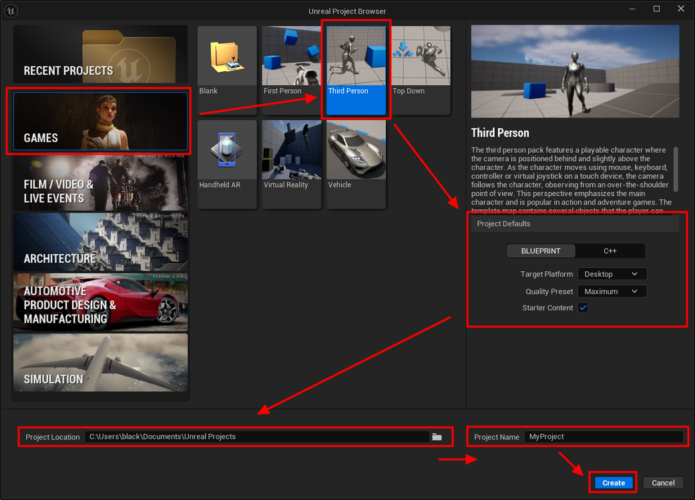

# Create a project

1. Select a project category (for example, **Games**).

2. Select a template (for example, **Third Person**).

3. Set the **Project Defaults**:

    * **Blueprint** or **C++**
    * **Target Platform**
    * **Quality Preset**
    * **Starter Content** (optional)

4. Set the **Project Location**.

5. Enter the **Project Name**.

6. Click **Create**.

    
