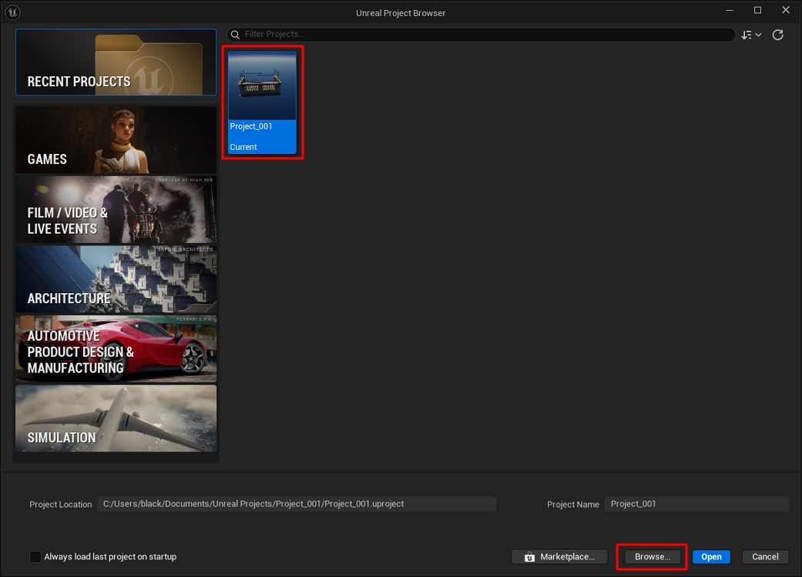

# Delete a project

Follow these steps to delete an Unreal Engine project.

!!! Warning  
    Deleting the project folder permanently removes the project.  
    Make sure you have a backup if needed.

1. Launch Unreal Engine.

2. In the Unreal Project Browser, select the project you want to delete, then click **Browse**.

    

3. In File Explorer, delete the project folder.

    ```
    Default location (example):
    C:\Users\<username>\Documents\Unreal Projects\
    ```

4. Restart Unreal Engine.

    The project will no longer appear in the Project Browser.