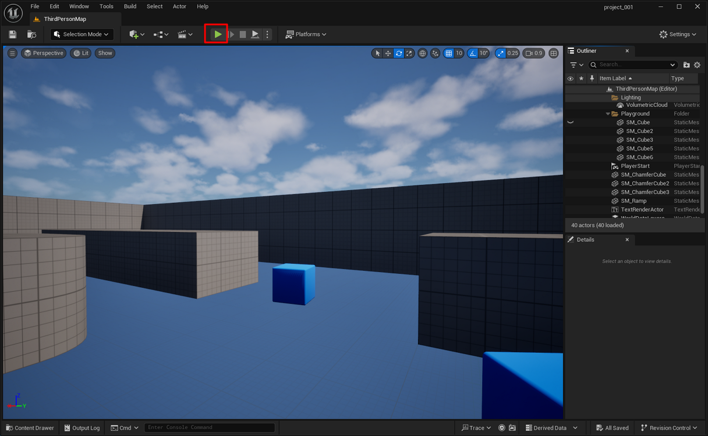

# Move an Actor in Third Person

Control the default Third Person character during gameplay.

## Steps

1. Click **Play** to start the game.

    

2. Use **W**, **A**, **S**, and **D** to move.

3. Press **Space Bar** to jump.

4. Press **Esc** to stop the game.
