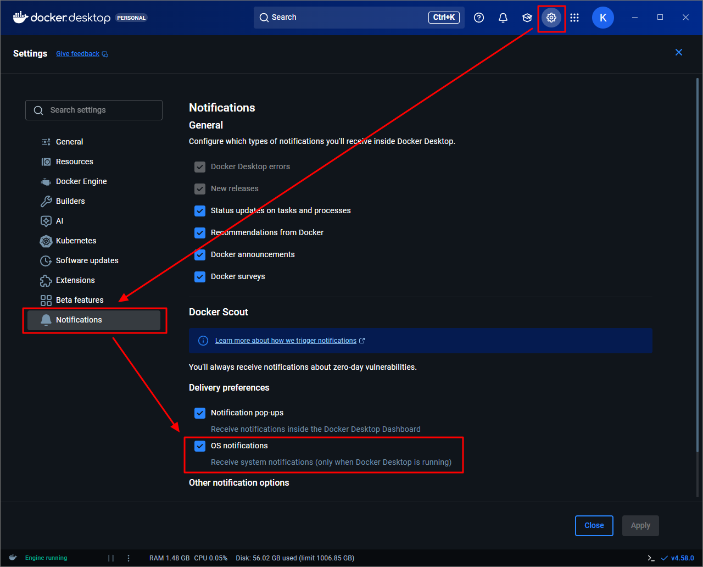

# Disable Scout OS notifications

To disable the following notification:
```bash title="Docker Desktop"
Scout wants to send OS Notifications through Docker Desktop
```
!!! Note
    Docker Scout is a built-in Docker tool.  
    It acts as a security and image health monitor, reporting potential security issues in your images.

1. Select **Settings** > **Notifications**.
1. Disable **OS notifications**.
    
