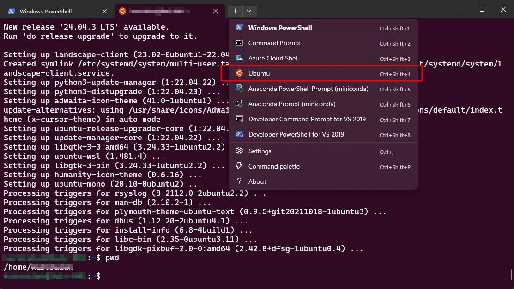
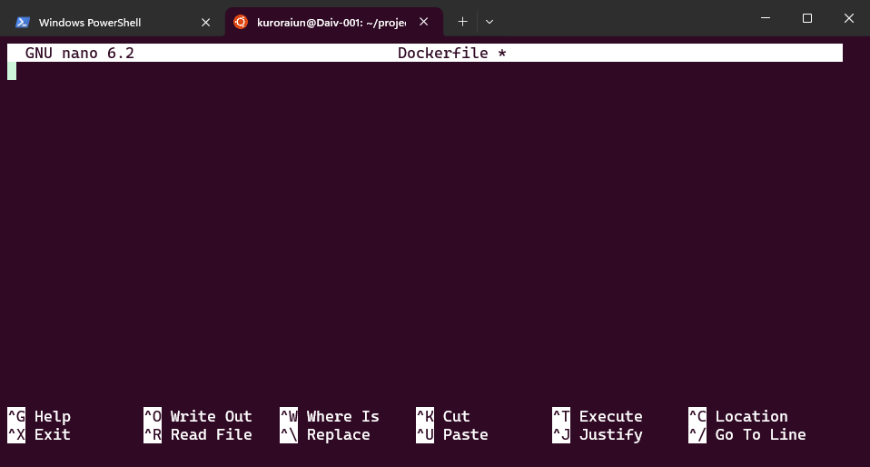
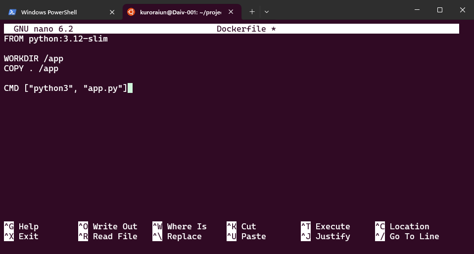
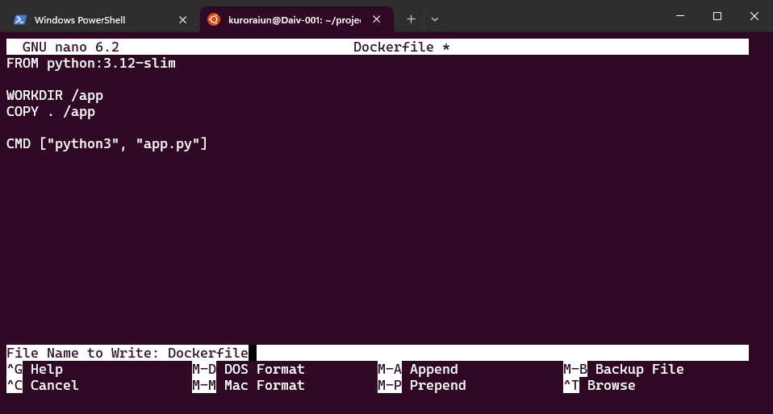
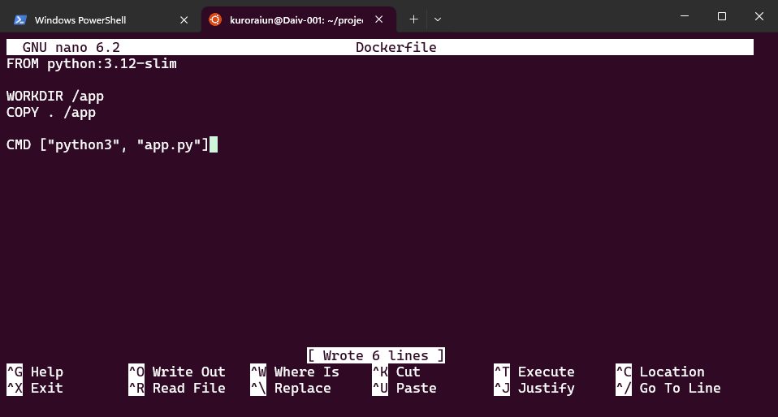

# Use the nano editor

1. Open the Ubuntu terminal.
   

2. Create a new file and open it:

      ```bash
      nano Dockerfile
      ```
   

4. Write your content, then press **Ctrl + O** to save the file.
   

5. Press **Enter** to confirm the file name.
   

6. Press **Ctrl + X** to exit.
   
