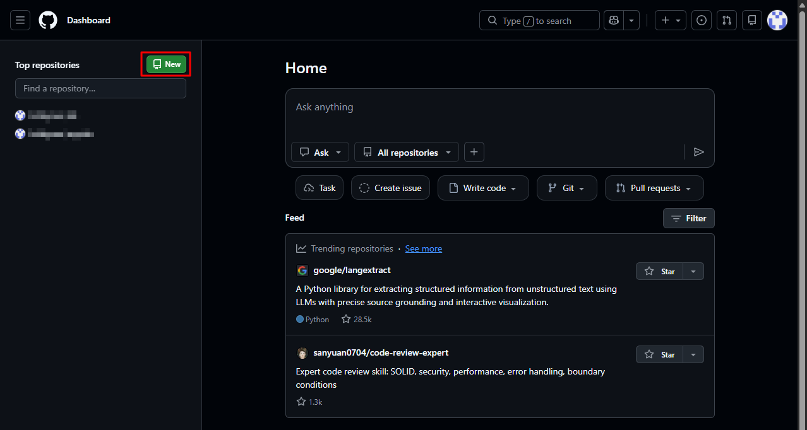
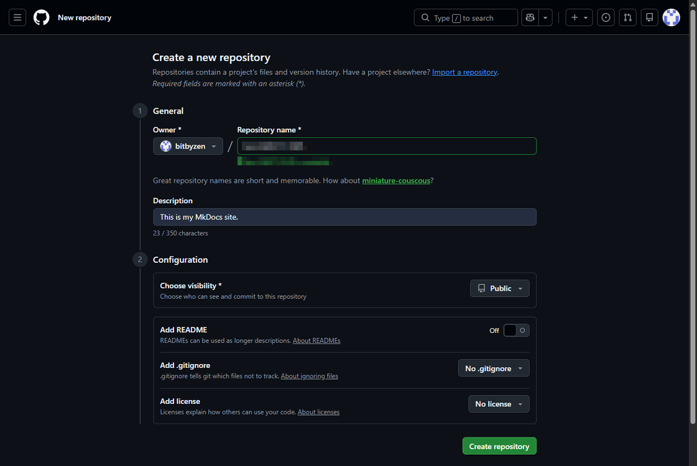
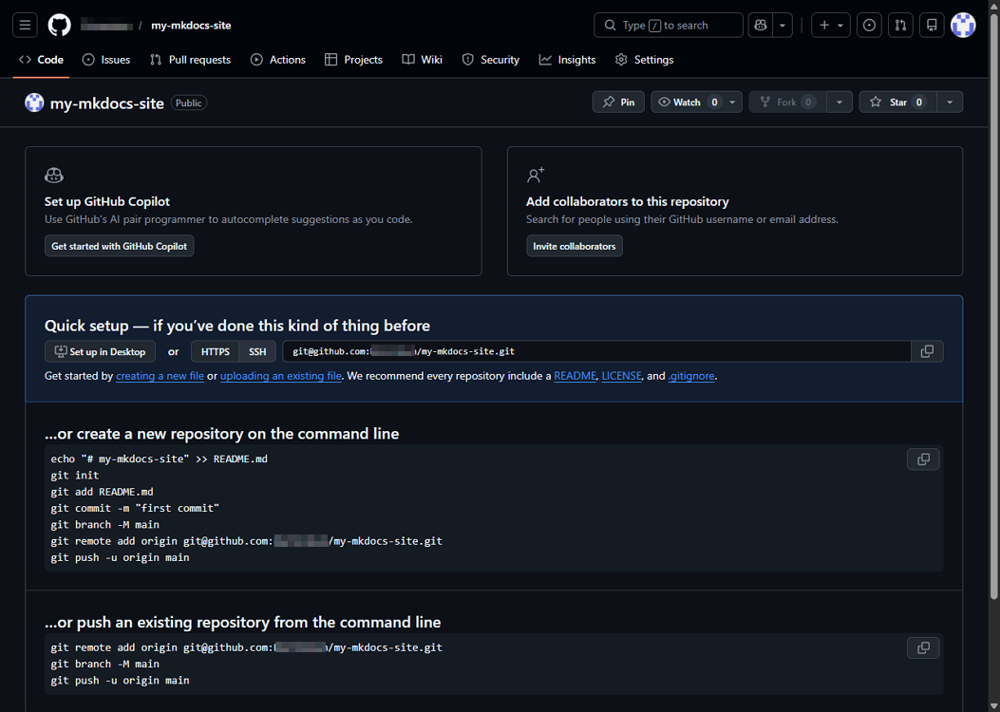
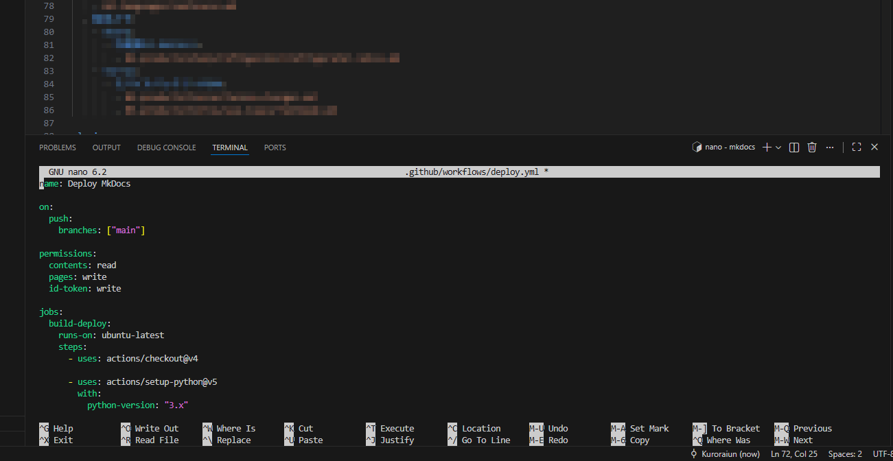
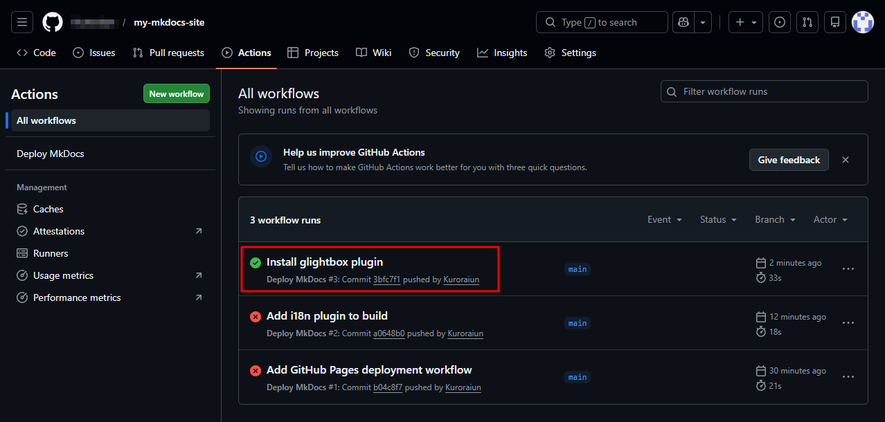
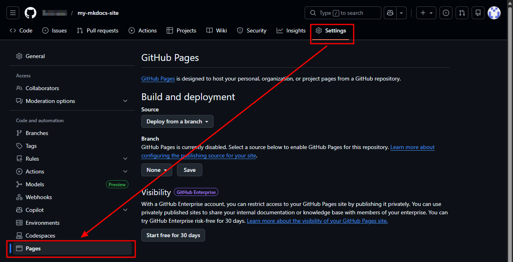
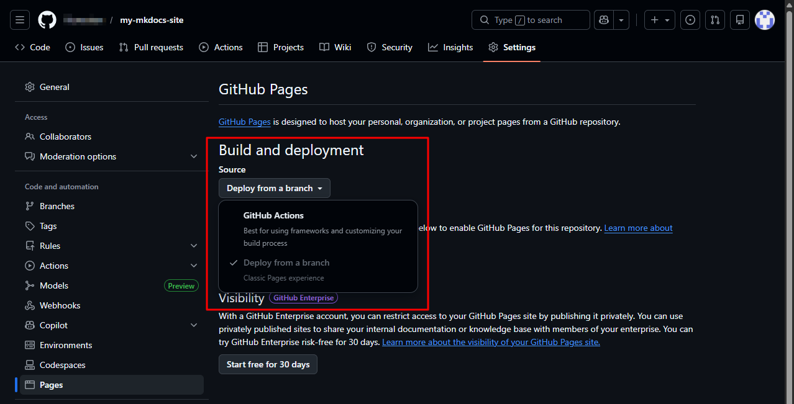

# Publish a Docker-based MkDocs site to GitHub Pages

This guide assumes you build and preview MkDocs **inside Docker**, and publish to **GitHub Pages** using **GitHub Actions**.

---

## Prerequisites

- A GitHub account
- A MkDocs project folder that contains:
  - `mkdocs.yml`
  - `docs/` (your Markdown pages)
- Docker installed locally (for preview/build)
- Git installed locally (for pushing to GitHub)

---

## 1) Create a GitHub repository

1. Log in to GitHub.

2. Click **New** to create a repository.

    

3. Set the following options:
    - **Repository name**: Any name
    - **Description**: Any description
    - **Choose visibility**: **Public** (required for free GitHub Pages on personal accounts)
    - **Add README**: **Off** (optional)
    - **Add .gitignore**: **No** (optional)
    - **Add license**: **No** (optional)

    

4. The repository is created.

    

 
## 2) Preview the site locally

1. In the project root folder in VS Code, run:

      ```bash
      docker run --rm -it \
        -p 8000:8000 \
        -v "$(pwd)":/mkdocs \
        my-mkdocs \
        mkdocs serve -a 0.0.0.0:8000
      ```

    !!! Tip
        Make sure your Docker image `my-mkdocs` is already built.

2. Open the local site:

      ```text
      http://localhost:8000
      ```

## 3) Initialize git and push the files to GitHub

1. In the project root folder in VS Code, run:

      ```bash
      git init
      git add .
      git commit -m "Initial MkDocs site"
      git branch -M main
      git remote add origin https://github.com/YOUR_USERNAME/REPO_NAME.git
      git push -u origin main
      ```
    !!! Note
        - If you already ran `git init`, skip it.
        - If `origin` already exists, update it:

            ```bash
            git remote set-url origin https://github.com/YOUR_USERNAME/REPO_NAME.git
            ```

## 4) Add a GitHub Actions workflow to build and deploy

1. Create the workflow folder in the project root:

      ```bash
      mkdir -p .github/workflows
      ```

2. Create and open the workflow file:

      ```bash
      nano .github/workflows/deploy.yml
      ```

3. Add the following content:

      ```yaml
      name: Deploy MkDocs

      on:
        push:
          branches: ["main"]

      permissions:
        contents: read
        pages: write
        id-token: write

      concurrency:
        group: "pages"
        cancel-in-progress: true

      jobs:
        build-deploy:
          runs-on: ubuntu-latest
          steps:
            - uses: actions/checkout@v4

            - uses: actions/setup-python@v5
              with:
                python-version: "3.x"

            # Install the same plugins used locally
            # Prefer: pip install -r requirements.txt

            - run: |
                pip install \
                  mkdocs \
                  mkdocs-material \
                  mkdocs-static-i18n \
                  mkdocs-glightbox

            - run: mkdocs build

            - uses: actions/upload-pages-artifact@v3
              with:
                path: site

            - uses: actions/deploy-pages@v4
      ```
    

4. Commit and push the workflow:

      ```bash
      git add .github/workflows/deploy.yml
      git commit -m "Add GitHub Pages deployment workflow"
      git push
      ```

5. Open the **Actions** tab and confirm that the workflow completes successfully (green ✅).

    

## 5) Enable GitHub Pages (use GitHub Actions as the source)

1. Go to **Settings > Pages**.

    

2. Under **Build and deployment > Source**, select **GitHub Actions**.

    

3. The site should be available at:

      ```text
      https://YOUR_USERNAME.github.io/REPO_NAME/
      ```

    !!! Note
        Changes are published after the GitHub Actions workflow completes.  
        If updates do not appear immediately, wait for the green ✅ in **Actions**
        and refresh the page.
