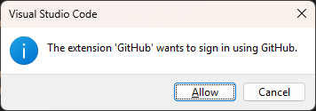
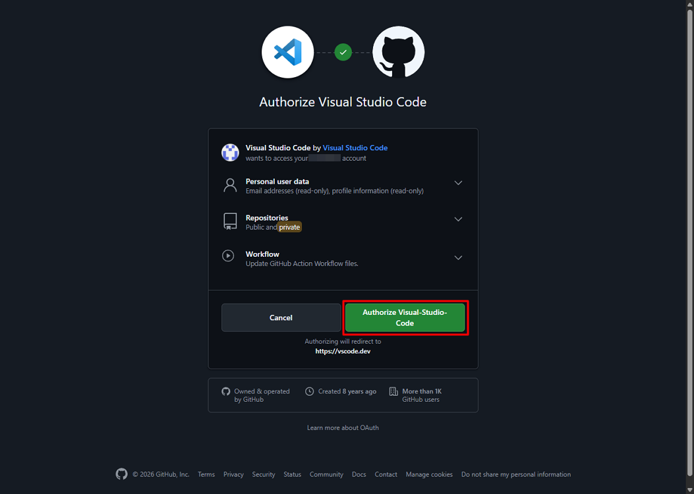

# Connect to GitHub

1. Run:

    ```bash
    git push -u origin main
    ```

2. Click **Allow** when the following dialog appears:

    ```
    The extension 'GitHub' wants to sign in using GitHub.
    ```

    

3. Click **Authorize Visual Studio Code** in your browser.

    

4. Click **Open Visual Studio Code**.

    

5. Close the browser page.

    

